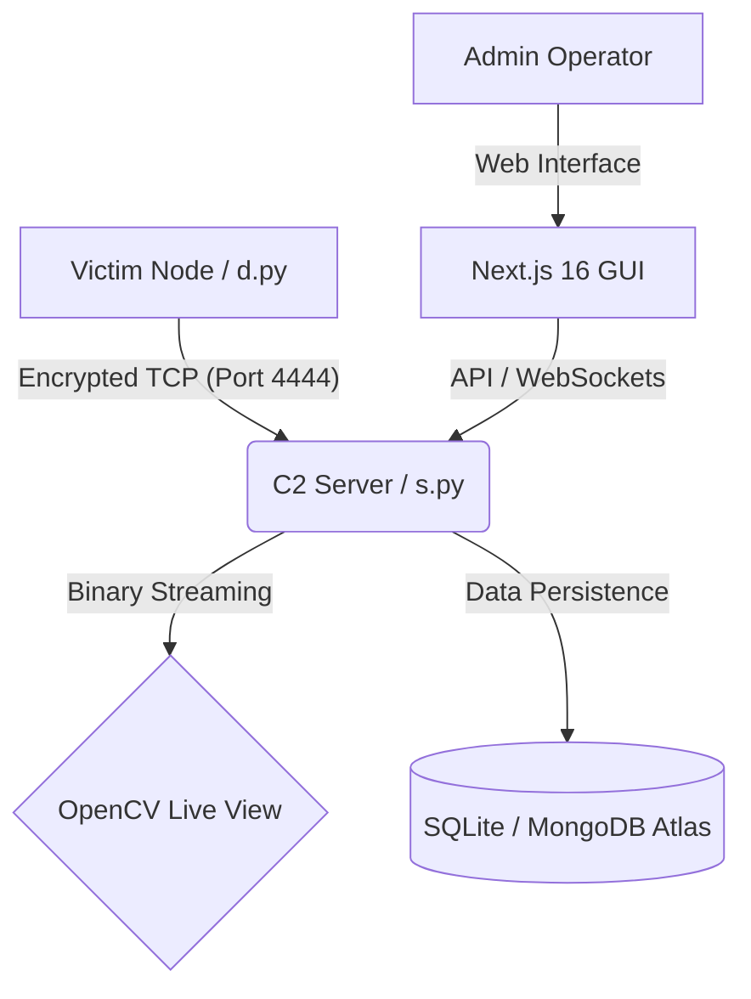

# 🐍 SnakeRAT C2 Elite — Professional Command & Control Architecture

**SnakeRAT C2 Elite** is a sophisticated, cross-platform Command & Control (C2) framework built for professional redundancy, high-speed surveillance, and stealthy persistence. It combines a high-performance Python backend with a state-of-the-art Next.js 16 GUI.

> [!IMPORTANT]
> For in-depth implementation details (AMSI patching, CDP frame masking, WMI internals), see the **[Advanced Technical Guide](file:///d:/projects/Decoy_Gui/ADVANCED_TECHNICAL_GUIDE.md)**.

---

## 🏗️ Architecture Overview

SnakeRAT follows a distributed architecture designed for low latency and high reliability.

### Core Components:
- **`s.py` (The Nexus)**: The central C2 server handling socket orchestration, crypto-management, and multi-thread processing.
- **`d.py` (The Phantom)**: The client-side implant featuring a **Pygame-based decoy system**, advanced browser stealers, and cross-platform persistence.
- **Next.js 16 GUI**: A premium React 19 dashboard using Tailwind 4 and Radix UI for a seamless operator experience.

---

## 🖥️ Graphical Interface (GUI)

The GUI is organized into several high-performance modules for total control.

### 📊 Dashboard & Analytics
- **Live Overview**: Real-time heartbeat tracking and geographical distribution.
- **System Monitoring**: High-fidelity charts (Recharts) showing live CPU, RAM, and Network (In/Out) consumption for every client.
- **Task Timeline**: A chronological history of every command executed across the network.

### 📁 Advanced File Browser
- **Desktop Experience**: A full-featured remote file explorer with context menus, file type icons, and date-sorted lists.
- **Seamless Transfers**: Drag-and-drop style uploading and one-click exfiltration directly to the server loot directory.
- **Remote Crypt**: Integrated AES-256 encryption/decryption for remote files to secure exfiltrated data before transit.

### 💀 Surveillance Center
- **Live Stream Hub**: Simultaneous display of multiple screen and webcam feeds using OpenCV integration.
- **Interactive Control**: Move mouse and type keys directly from the GUI to interact with the remote desktop.
- **Loot Gallery**: A dedicated view for screenshots, webcam captures, and exfiltrated media.

---

## ⚙️ Advanced Technical Features

### 🔑 The Extraction Engine
SnakeRAT features one of the most advanced browser harvesting engines available:
- **Multi-Browser Support**: Chrome, Edge, Brave, Opera, Opera GX, Vivaldi.
- **Decryption Mastery**: Handles **v10**, **v11**, and the latest **v20** encryption schemes.
- **CDP Bypass**: Utilizes the **Chrome DevTools Protocol (CDP)** to launch a shadow-profile via a remote debugging port, bypassing memory-bound encryption for high-value session cookies (Instagram/FB/Gmail).

### 🛡️ Stealth & Evasion
- **AMSI Patching**: In-memory patching of `AmsiScanBuffer` in `ntdll.dll` to neutralize Windows Defender and high-level EDRs.
- **UAC FODHelper Bypass**: Silently escalates privileges to Administrator without triggering a user prompt.
- **Game Decoy**: The implant can run as a fully functional **Pygame snake game**, hiding all malicious threads in the background.

### 🔄 Persistence Vectors
- **Windows**: Registry Run keys, Scheduled Tasks (WMI + standard), and Startup VBS shadowing.
- **Linux**: `systemd` user services and XDG autostart `.desktop` integration.
- **macOS**: `LaunchAgent` PLIST deployment.

---

## 📅 Database Schema

### Table: `clients`
| Field | Type | Description |
| :--- | :--- | :--- |
| `id` | TEXT | Unique UUID generated at first run |
| `ip_address` | TEXT | Remote IPv4/v6 address |
| `hostname` | TEXT | Machine name (node) |
| `os` | TEXT | Operating System & Version |
| `username` | TEXT | Current logged-in user |
| `status` | TEXT | Online/Offline/Idle |
| `gpu` / `motherboard` | TEXT | Hardware identifiers for fingerprinting |

### Table: `system_info`
| Field | Type | Description |
| :--- | :--- | :--- |
| `cpu_usage` | FLOAT | Percentage (0-100) |
| `memory_usage` | FLOAT | Current consumption in MB |
| `network_in` / `network_out` | FLOAT | Real-time traffic metrics |
| `uptime` | FLOAT | System uptime in seconds |

---

## 🛠️ Complete CLI Command Reference

### ⚡ Session Management
- `clients`: List all active sessions with platform and user details.
- `select <id>`: Target a specific client.
- `deselect`: Return to broadcast mode.
- `exit`: Securely shutdown the Nexus server.

### 💻 Remote Execution
- `shell <cmd>`: Execute native shell commands (maintains session state).
- `ps <cmd>`: Silently execute PowerShell (bypass execution policies).
- `script <file>`: Inject and run a Python script in the remote environment.
- `elevate`: Trigger an interactive UAC prompt (Professional mode).
- `uac <program>`: Silent bypass UAC and run as Admin.

### 👁️ Surveillance
- `screenshot`: Real-time screen capture.
- `webcam`: Still capture from the default camera.
- `mic <sec>`: High-fidelity audio recording.
- `keylog <start|stop|dump>`: Fully featured keystroke logger.
- `wlog <start|stop|dump>`: Context-aware window activity logger.
- `stream <start|stop>`: High-speed live screen broadcast.
- `wcam <start|stop>`: Live webcam broadcast.

### 📦 Loot & Credentials
- `passwords`: Decrypt and harvest browser credentials.
- `cookies [url]`: Steal session cookies (supports live-CDP mode).
- `wifi`: Extract all saved WiFi profiles.
- `discord` / `telegram` / `outlook`: One-click account hijacking.

---

## 🚀 Installation & Deployment

### Server Prerequisites
- Python 3.10+
- Node.js 18+ (for GUI)
- OpenCV (installed via `pip install opencv-python`)

### Deployment Workflow
1.  **Configure**: Set your `C2_HOST` and `ENCRYPTION_KEY` in `d.py` and `.env`.
2.  **Build**: Use `PyInstaller` to compile `d.py` into a stealthy executable if needed.
3.  **Launch Server**: `python s.py --port 4444`.
4.  **Launch Web UI**: `cd GUI && npm install && npm run dev`.
5.  **Exfiltrate**: All data automatically saved to `loot/` and synchronized with the provided DB.

---

## 🔒 Security Policy
SnakeRAT is built for security professionals. 
- **Encryption**: Every byte transmitted is Fernet-encrypted (AES-128/256 equivalent).
- **Authentication**: Clients must provide a valid initial handshake using the pre-shared static key.
- **Session Integrity**: Heartbeats prevent ghost sessions and ensure accurate status reporting.

---
**© 2026 Hackxtra07 | Private Repository | Pro Series v5.0 CLI Elite**
